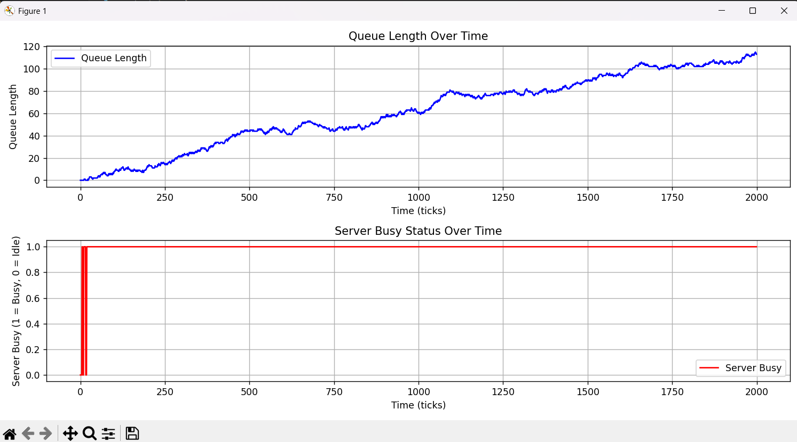
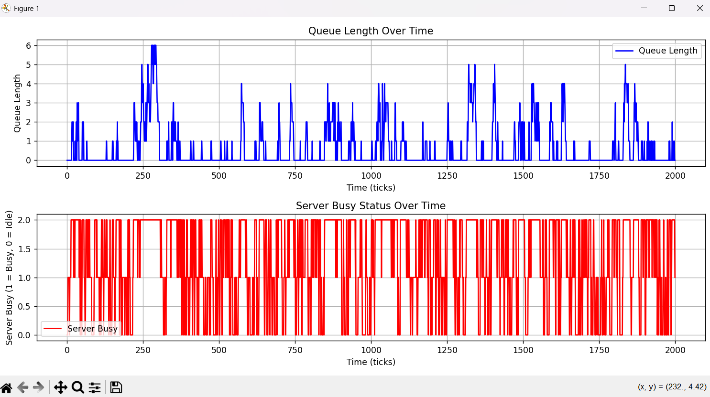

# Simple Workflow Simulation


## Project Overview

This repository contains a modular, object-oriented framework for building and analyzing discrete-time workflow simulations. The project's core is a flexible `Simulation` engine designed to model queuing systems—a fundamental concept applicable to countless real-world scenarios, from customer service call centers and manufacturing assembly lines to web server request handling.

The project tells a compelling story through simulation: it begins by modeling a single-server system under high load to demonstrate how system instability arises. It then evolves to a stable multi-server configuration, showcasing a data-driven approach to solving system bottlenecks. This serves as a hands-on application of object-oriented design, statistical modeling, and data visualization to solve a tangible problem in systems analysis.

## Key Methodologies & Concepts

* **Object-Oriented Architecture:** The framework is built around a central `Simulation` class that orchestrates the workflow, and modular `Task` and `Server` classes that represent the system's core entities. This design promotes reusability, modularity, and a clean separation of concerns.
* **Discrete-Time Simulation:** The system state is updated at fixed time intervals ("ticks"). The main simulation loop iterates through time, triggering events, updating component states, and collecting metrics at each step.
* **Stochastic Event Modeling:** To mimic real-world randomness, the simulation employs statistical distributions:
  * **Poisson Distribution (`np.random.poisson`):** Models the number of new tasks arriving in a given time interval, ideal for events that occur independently at a constant average rate.
  * **Exponential Distribution (`np.random.exponential`):** Models the time required to complete a task, accurately representing scenarios where most tasks are quick, but a few take significantly longer.
* **Queuing Theory:** The project applies the fundamental concept of **Traffic Intensity (ρ)** to predict system stability. This metric quantifies the ratio of arrival rate to service rate and serves as a powerful theoretical benchmark to validate the simulation's results.
* **Data Visualization:** `Matplotlib` is used to generate time-series plots of key performance indicators (KPIs), primarily queue length and server utilization, which are essential for interpreting the system's dynamic behavior.

## System Architecture

The simulation framework is designed with a clear separation between the simulation engine and the driver script.

* **`Simulation` Class:** This is the heart of the framework. It encapsulates the entire simulation state (server pool, task queue) and logic. Its methods are responsible for handling task arrivals, assigning work to servers, ticking the clock, and collecting historical data for later analysis.
* **`components` (`Task` and `Server`):** These are the modular building blocks.
  * `Task`: Represents a unit of work with a defined creation time and a randomly generated service time.
  * `Server`: Represents a resource that processes tasks, maintaining its own state (busy/idle) and an internal countdown timer for its current job.
* **`run_simulation.py`:** This script acts as the main entry point or "driver." Its responsibilities are limited to:
    1. Configuring the simulation parameters (e.g., number of servers, arrival rates).
    2. Instantiating the `Simulation` class with the chosen configuration.
    3. Executing the simulation run.
    4. Retrieving the results and generating the final plots.

## Getting Started

### Prerequisites

* Python 3.8+
* NumPy
* Matplotlib

### Installation

1. **Clone the repository:**

    ```bash
    git clone https://github.com/Fusion831/Simple-Workflow-Simulation.git
    cd Simple-Workflow-Simulation
    ```

2. **Install dependencies:**

    ```bash
    pip install numpy matplotlib
    ```

### Execution

To run the simulation, execute the main script from the root directory:

```bash
python run_simulation.py
```The console will output a prediction of system stability based on queuing theory, followed by the final summary statistics. Matplotlib plots will then be displayed.

## Simulation Analysis: From Instability to Resolution

### Part I: The Single-Server Bottleneck
The initial analysis models a system with one server facing a workload it cannot handle. The system's parameters result in a Traffic Intensity (ρ) greater than 1, which theory predicts will lead to instability.

*   **Traffic Intensity (ρ) = Arrival Rate (λ) \* Average Service Time (T) > 1**

**Results:**



**In-depth Analysis:**
*   **Queue Length (Top Plot):** The plot provides clear visual evidence of the theoretical prediction. The queue length trends relentlessly upwards, indicating the system is accumulating a backlog much faster than it can clear it.
*   **Server Status (Bottom Plot):** The server's utilization jumps to 100% and stays there, demonstrating it is completely saturated and acting as a critical bottleneck.

### Part II: Achieving Stability with Parallel Processing
The logical solution to the bottleneck is to add more processing capacity. By introducing a second server, we change the stability equation for the system as a whole.

*   **Multi-Server Traffic Intensity (ρ) = λ / (Number of Servers \* Service Rate) < 1**

With the same arrival rate, the combined service capacity of two servers is now sufficient to handle the load, bringing the traffic intensity below the critical threshold of 1.

**Results:**



**In-depth Analysis:**
*   **Queue Length (Top Plot):** The queue behavior is now fundamentally different. It is **stable and bounded**. While it experiences occasional spikes, the system has enough throughput to process these tasks and consistently bring the queue length back down.
*   **Server Status (Bottom Plot):** This plot, showing the number of busy servers, is highly dynamic. The periods where the value is 0 (both servers idle) are crucial—they represent the spare capacity that allows the system to absorb random spikes in demand without becoming unstable.

## Quantitative Findings

| Metric                        | Unstable System (1 Server) | Stable System (2 Servers) |
| ----------------------------- | -------------------------- | ------------------------- |
| **System Stability (ρ)**      | Unstable (ρ > 1)           | Stable (ρ < 1)            |
| **Queue Behavior**            | Unbounded Growth           | Bounded and Stable        |
| **Server Pool Utilization**   | ~100%                      | ~80% (Efficiently utilized) |
| **Average Task Wait Time**    | Very High (and growing)    | Low and manageable        |

## Future Enhancements

The current framework provides a robust foundation for discrete-time simulation. The most significant architectural evolution would be to transition to a more advanced simulation paradigm.

*   **Transition to a Discrete-Event Simulation (DES) Model:**
    *   **Current Model (Discrete-Time):** The simulation advances by a fixed time-step (a "tick"), and the entire system state is checked at every step. This is simple to implement but computationally inefficient, as many ticks may pass where no event occurs.
    *   **Proposed Model (Discrete-Event):** Instead of a fixed tick, the simulation clock would **jump directly to the time of the next scheduled event**. This requires an "event calendar," typically implemented with a priority queue (`heapq`), which stores future events (e.g., "a task arrival at t=10.3," "server 2 will finish its task at t=12.1").
    *   **Benefit:** This approach is vastly more efficient for simulations with sparse events or long durations, as it completely skips the "dead time" between events.

*   **Cost-Benefit Analysis:** Introduce a cost model. For example, assign a cost per tick for running a server and a cost per tick for a task waiting in the queue. The simulation could then be used to find the optimal number of servers that minimizes total operational cost.

*   **Priority Queues:** Implement a priority system where some tasks are more important than others. This would involve replacing the standard FIFO `deque` with a priority queue (`heapq`) and adding a `priority` attribute to the `Task` class.
